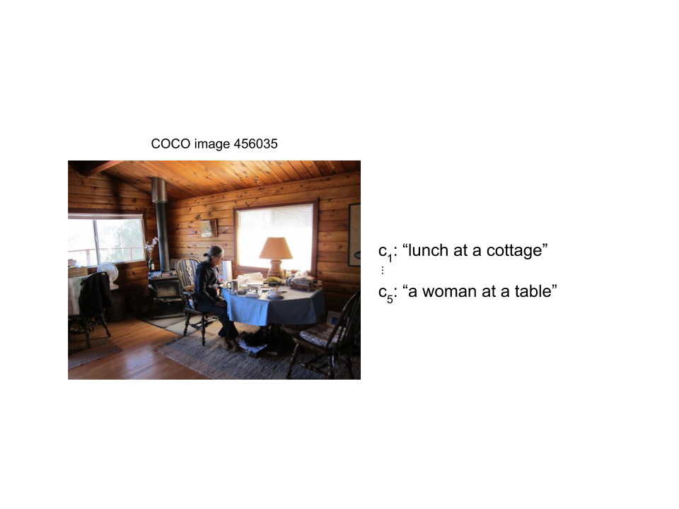

---
jupyter:
  jupytext:
    text_representation:
      extension: .md
      format_name: markdown
      format_version: '1.2'
      jupytext_version: 1.5.0
  kernelspec:
    display_name: Python 3
    language: python
    name: python3
---

# Language Module Capstone: Semantic Image Search

Now that we're familiar with different methods for understanding language through word embeddings, let's apply these skills to semantically search a database of images based on a query.
This project will bring together different concepts we've covered so far, including word embeddings and image embeddings (descriptors).
Basically, we want to pull up the top images associated with some query like Google Images does.
If our query is "orange juice", we expect images of orange juice, and possibly oranges or juice to be pulled up, but not an image of a truck.

We've seen many examples of embeddings, or vectors meant to describe an object, throughout the course. These include GloVe word embeddings, FaceNet facial descriptors, and bag of words vectors. 
The common theme for these embeddings is that similar objects (synonymous words or images of the same face from different angles) have similar embeddings (this can be determined using cosine similarity).

<!-- #raw -->

<!-- #endraw -->

In order to semantically search through a database of images, we're going to apply this same concept but across different object types.
Namely, we want to find *images* that are semantically similar to *words*. 
Instead of relying on embeddings in the word space to find similar words or the face space to find similar faces, we are going to search the *semantic space* to find *images* that are similar to *words*.

<!-- #raw -->

<!-- #endraw -->

Let's break this down into some concrete steps

1. Embed our query text: `se_text()`
2. Embed the images in our database: `se_image()`
3. Compute the similarity between our query embedding, `se_text(query)`, and all image embeddings `se_image(img)` in the database
4. Return the top k most similar images (images with the highest cosine similarity)

Before diving into each of these steps, let's take a look at the dataset of captioned images that we'll make use of, called COCO (Common Objects in Context).
COCO is a dataset that, among other things, provides images with 5 captions each, where each caption is a human-generated phrase describing the image.
We want to map both images and captions to our semantic space such that captions that are good descriptions for an image have a similar embedding and captions that are not have a very different embedding.
This way, our text embedder `se_text()` will be able to not only map captions close to their respective images, but also to map new query text to a space that is near semantically similar images.

<!-- #raw -->

<!-- #endraw -->

## Embedding Text

We will use GloVe-50 to generate embeddings for our image captions and query text.
This will produce 50-dimensional semantic embeddings for our text.
We will weight our embeddings by each word's inverse document frequency (IDF).
This essentially weights terms depending on the number of documents in which they appear in a corpus such that specialized, rare terms have a higher weighting than more commonplace, general terms.
Let's call this function that generates the GloVe-50 embedding and weights it according to the IDF `se_text()`.

## Embedding Images

We will use a pre-trained computer vision neural network on ImageNet to generate descriptor vectors for our images.
More specifically, we'll utilize an 18-layer convolutional neural network called ResNet18.
Note that we will remove the final classification layer (the softmax layer) to obtain a 512-dimensional descriptor vector for each image.

<!-- #raw -->

<!-- #endraw -->

Now that we have image descriptor vectors, we need to perform dimensionality reduction in order to obtain 50-dimensional image embeddings in the same semantic space as the word embeddings that we get from `se_text()`.
As you know, autoencoders are quite handy for dimensionality reduction...

### Approach: Employing an Autoembedder

So far, we have text that is mapped to semantically similar text in the word space (50-dimensional GloVe embeddings) and images that are mapped to similar images according to abstract features in the image space (512-dimensional ResNet18 descriptor vectors).
In order to accomplish our goal of mapping query text to semantically similar images, we need an autoencoder that can map 512-dimensional image descriptor vectors to 50-dimensional embeddings in the semantic space that our text is in.

Our autoembedder will consist of a dense layer that takes a 512-dimensional input and compresses it to a 50-dimensional embedding.
Note that this is not a complete autoencoder because it does not have a mirroring layer to decompress the embedding back to a recovered descriptor vector.
We will train the embedder to map images to our 50-dimensional semantic space such that they are "close to" their relevant captions (i.e. have similar embeddings - can be verified using cosine similarity).
We'll call this trained model `se_image()`.
Thus, we will be able to use our trained weight matrix, $M$, and bias vector, $b$, from the dense layer to efficiently compress all of the images in our database to the semantic space where our captions and queries lie.

<!-- #raw -->

<!-- #endraw -->

Once we have accomplished this, we can simply embed a query using `se_text()` and return the $k$ closest images, or the $k$ images with embeddings most similar to `se_text(query)` according to cosine similarity.

Now that we know exactly what we want our autoembedder to do, let's dive into training it.

### Training our Autoembedder

In order to train an autoembedder to cluster images based on their relevance to textual embeddings that already exist in the semantic space, we need some way to determine if an image embedding is close to "good" textual embeddings and far from "bad" textual embeddings.
In other words, we want to train our autoembedder to produce image embeddings that are similar to the embeddings of valid captions/text and very different from embeddings of irrelevant captions/text.
This can be done by choosing a random good caption for an image (an actual caption of the image) and a random bad caption (not one of the image's captions) then embedding the image using the dense layer and comparing the similarity between the image embedding and the good caption's embeddings (we'll call this `sg`) vs. the image embedding and the bad caption's embedding (we'll call this `sb`).
We want `sg` to be considerably greater than `sb`.
This becomes an important concept in our loss function because we want there to be more loss when `sg` and `sb` are too close (and especially when `sb` is greater than `sg`).
This type of loss function is called **margin ranking loss**.

As the name implies, margin ranking loss relies on the *margin* of different between the "good" and "bad" similarity calculations.
Essentially, the loss function works by assessing `sg - sb` and weighting the loss based on how close they are, below a certain margin.
If our margin is $0.1$, any difference between `sg` and `sb` (such that `sg` is higher) that is greater than $0.1$ is considered acceptably different, so there is no loss (the parameters $M$ and $b$ are not modified).
On the other hand, if `sg` and `sb` are less than $0.1$ apart (including when `sb` is higher), there is loss that depends on exactly how small `sg-sb` is.
This effectively creates more drastic loss when the autoembedder produces image embeddings that map images closer to invalid text than valid text.

The process of calculating margin ranking loss loss based on sets of triplets `(text,good_img,bad_img)` can be visualized as follows

<!-- #raw -->

<!-- #endraw -->

## Team Tasks

Below you'll find a list of tasks that your team needs to cover to successfully complete this capstone project.

* embed caption and query text (using GloVe-50)
* create a MyNN model for embedding images
* extract sets of triples (training and validation sets)
* write function to compute loss (margin ranking loss) and accuracy
* train the model
    * embed the caption
    * embed the good image
    * embed the bad image
    * compute similarities (caption and good image, caption and bad image)
    * compute loss and accuracy
    * take optimization step
* generate image feature vectors (descriptors) using ResNet18
* create image database by mapping image feature vectors to semantic embeddings with trained model
* write function to query database with a caption-embedding and return the top-k images
* write function to display set of images given COCO image ids
