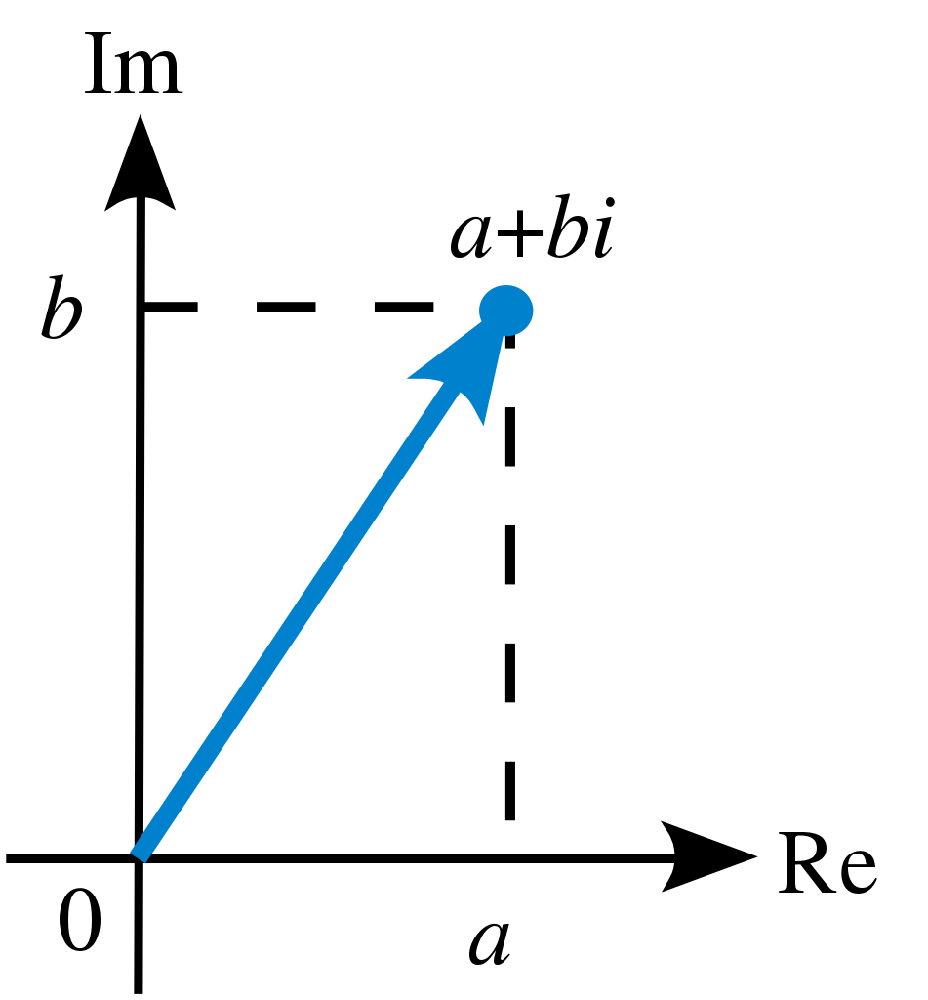

---
jupyter:
  jupytext:
    text_representation:
      extension: .md
      format_name: markdown
      format_version: '1.2'
      jupytext_version: 1.5.0
  kernelspec:
    display_name: Python 3
    language: python
    name: python3
---

<!-- #raw raw_mimetype="text/restructuredtext" -->
.. meta::
   :description: Topic: Math supplement, Difficulty: Easy, Category: Section
   :keywords: imaginary number, complex number, complex addition, complex subtraction, complex multiplication, complex division, complex conjugate, magnitude, eulers formula
<!-- #endraw -->

# Complex Numbers


We will talk about complex numbers in this section, which are incredibly useful even when stepping outside the theoretical world of math to deal with real-world data.
First, we will discuss the unit imaginary number $i$, and learn about how to represent any imaginary number.
Then, we will discuss how to compose complex numbers and how these are represented in both mathematics and Python.
Finally, we will discuss Euler's Formula, an important connection between exponential and sinusoidal functions that is vital to understand for the audio-related portion of this course.

## What are Imaginary Numbers?


We are familiar with working with elements of the set of **real numbers** $\mathbb{R}$, e.g $-2$, $\sqrt{3}$, and $\frac{2}{3}$.
We often specify that a number $x$ is real by saying it lies in the set of real numbers, denoted as $x\in\mathbb{R}$.

As we will see later, imaginary numbers will allow us to *extend* real numbers into complex numbers.
However, to understand imaginary numbers, we must first consider the equation $x^2 = -1$.

We know that the square of any $x\in\mathbb{R}$ is non-negative, i.e. $x^2 \geq 0$.
It would seem, then, that the equation $x^2 = -1$ cannot be satisfied if we choose to work solely with real numbers. 
For this reason, we will define a new number, $i$, to be the solution to this equation.

<div class="alert alert-info">

**Definition**: 

The **imaginary unit** $i$ is defined as the solution to the equation $x^2 = -1$.
Often this is written as $i = \sqrt{-1}$.
Typically $i$ is called the unit imaginary number or the imaginary unit to distinguish it from other imaginary numbers.

</div>

From the property $i^2 = -1$, we can actually determine all powers of $i$:

\begin{align}
i^1 &= i \\
i^2 &= -1 \\
i^3 &= i^2 \cdot i = -1 \cdot i = -i \\
i^4 &= i^3 \cdot i = -i \cdot i = -(i^2) = -(-1) = 1 \\
i^5 &= i^4 \cdot i = 1 \cdot i = i
\end{align}

We can see that the pattern above keeps repeating every 4 powers of $i$, as evidenced by $i^1 = i^5 = i$.
In particular,

\begin{equation} i^n = i^{n \text{ mod } 4}, \end{equation}

where $n \text{ mod } 4$ is the remainder of $n$ divided by $4$ (in Python, we would compute this as `n % 4`).

<div class="alert alert-info">

**Reading Comprehension: Computing Powers of i**

Using the previous expression for powers of $i$, calculate the following:

- $i^6$
- $i^{12}$
- $i^0$
- $i^{-1}$
- $i^{260}$

</div>

### Calculating Square Roots of Negative Numbers Using $i$

Knowing that $i = \sqrt{-1}$ allows us to calculate the square roots of negative numbers, something we cannot do working only with real numbers.
Let's consider $\sqrt{-16}$, which we can evaluate using our knowledge of $i$ as

\begin{equation}
\sqrt{-16} = \sqrt{-1 \cdot 16} = \sqrt{i^2 \cdot 4^2} = \sqrt{i^2} \cdot \sqrt{4^2} = 4 \cdot i.
\end{equation}

This value, $4 \cdot i$ (often written simply as $4i$), is an **imaginary number**.
Imaginary numbers all take the form of a real number multiplied by the unit imaginary;
that is to say, if $b$ is a real number, then $bi$ is an imaginary number.
We can square $4i$ to make sure that we get back our original value of -16 again:

\begin{equation}
(4i)^2 = \big(4^2\big) \cdot \big(i^2\big) = 16 \cdot -1 = -16.
\end{equation}

Let's look at another brief example of calculating the square root of a negative number:

\begin{equation}
\sqrt{-8} = \sqrt{-1 \cdot 8} = \sqrt{i^2 \cdot 2^2 \cdot 2} = 2\sqrt{2}i.
\end{equation}

Just as before, the square root of $-8$, which we found to be $2\sqrt{2}i$, is an imaginary number.

<div class="alert alert-info">

**Takeaway**:

In order to calculate $\sqrt{-x}$, where $x > 0$:

1. Separate the square root into the product $\sqrt{-1}\cdot\sqrt{x}$
2. Represent the product as $\sqrt{i^2}\cdot\sqrt{x}$
3. Use power rules to arrive at the solution $\sqrt{-x} = \sqrt{x}i$

The final result is an imaginary number of the form $bi$, for some $b\in\mathbb{R}$.

</div>

<div class="alert alert-info">

**Reading Comprehension: Computing Square Roots of Negative Numbers**

Using the unit imaginary number $i$, calculate the following:

- $\sqrt{-20}$
- $\sqrt{-1}$
- $\sqrt{-30}$
- $\sqrt{-10}$
- $\sqrt{-5}$

</div>

## How Do We Create Complex Numbers?

We know that values such as $5$, $\sqrt{3}$, and $\frac{2}{3}$ are all elements of $\mathbb{R}$.
We also just saw that values such as $i$, $4i$, and $2\sqrt{2}i$ are all examples of *imaginary numbers*. 
But, what if we want to represent a number that is part real and part imaginary?

<div class="alert alert-info">

**Definition**: 

A **complex number** is a number of the form $a + bi$, where $a,b\in\mathbb{R}$ and $i$ is the imaginary unit.
We use the symbol $\mathbb{C}$ to denote the set of all complex numbers, with $z\in\mathbb{C}$ denoting that $z$ is a complex number.

</div>

In general, complex numbers satisfy the equality relationship that if $a + bi = u + vi$, then $a = u$ and $b = v$. 

### Representation of Complex Numbers in a Plane

Geometrically, we can think of complex numbers as points in a 2-D plane, which we call the complex plane. 
It is convention to have the horizontal axis be the *real axis* and the vertical axis be the *imaginary axis*.
So, the complex number $a+bi$ can be represented by the vector $\begin{bmatrix} a & b\end{bmatrix}$ in the complex plane, as depicted in the image below.

<!-- #raw -->
<div style="text-align: center">
<p>

</p>
</div>
<!-- #endraw -->

An attentive reader may be reminded of the diagrams in the [Fundamentals of Linear Algebra](https://rsokl.github.io/CogWeb/Math_Materials/LinearAlgebra.html) section.
Just like vectors in linear algebra, we can add, subtract, and find the magnitude of vectors in the complex plane (i.e. complex numbers)!
It is useful, but not necessary, to be comfortable with vector operations before we move on.

### Complex Numbers in Python

We can very easily represent complex numbers in Python as well!
Generally, we represent the complex number $a + bi$ as `a + bj` in Python.

<div class="alert alert-warning">

**Notational Note**

Electrical engineers use the symbol $j$ in place of $i$, as they often reserve $i$ for current.
This is why Python displays the complex number $2 + 3i$ as `2 + 3j`.
</div>

Along with the `a + bj` syntax, the built-in type `complex` can be used to create complex-type numbers: 

<!-- #region -->
```python
# creating complex numbers
>>> 2 + 3j
(2+3j)

>>> complex(2, 3)
(2+3j)

>>> complex(0, 1) ** 2
(-1+0j)

>>> type(2+3j)
complex

>>> isinstance(2-4j, complex)
True
```
<!-- #endregion -->

Note that `j` is not, by itself, reserved as a special placeholder for $i$.
Rather, `j` *must be preceded immediately with a numerical literal* (i.e. you cannot use a variable) in order for the Python interpreter to treat it as a complex number.
<!-- #region -->
```python
# `j` by itself is treated like any other character
>>> j
NameError: name 'j' is not defined

# `1j` is interpreted as the imaginary unit
>>> (1j) ** 2
(-1+0j)
```
<!-- #endregion -->

The `cmath` ("complex math") module provides a collection of mathematical functions defined for complex numbers, some of which we will detail below. For a complete listing of these functions, refer to the [official documentation](https://docs.python.org/3/library/cmath.html#module-cmath).

## Operations with Complex Numbers

As mentioned, we can perform many of the same operations on complex numbers that we do on regular vectors, as well as a few others.
This section will introduce these key operations and demonstrate how to use them in Python.

### Real and Imaginary Components of Complex Numbers

Before we begin performing operations like addition and subtraction on complex numbers, it's important that we know how to retrieve the real and imaginary parts of a complex number.

Suppose we have a complex number $z = a + bi$. 
To find the *real part* of $z$, we call $\operatorname{Re}(z)$.
This yields $a$, where $a \in \mathbb{R}$.
To find the *imaginary part* of $z$, we call $\operatorname{Im}(z)$, which returns $b$, where again $b \in \mathbb{R}$.

<div class="alert alert-warning">

**Note**

When we call $\operatorname{Im}(z)$ to find the imaginary part of a complex number, the resulting value is a *real number* ($b \in \mathbb{R}$).
The *imaginary component* $bi$ is a complex number ($bi \in \mathbb{C}$).
</div>

#### Real and Imaginary Components of Complex Numbers in Python 

We can easily access the real and imaginary components (the `a` and `b` from `a + bj`, respectively) in Python through `real` and `imag` attributes.
Let's look at the complex number $z = 1.2 - 3.4i$:

<!-- #region -->
```python
# Accessing the real and imaginary parts of
# a complex number.
>>> z = complex(1.2, -3.4) # z = 1.2 - 3.4i
>>> z.real
1.2
>>> z.imag
-3.4 
# Just like in math, the returned value is a real number
>>> type(z.imag)
float
```
<!-- #endregion -->

### Complex Addition and Subtraction

Just like with vectors, to add and subtract two complex numbers is *to add and subtract their real and imaginary components individually*. 
Hence the sum of the complex numbers $a+bi$ and $u+vi$ will be

\begin{equation}
(a+bi) + (u+vi) = (a+u) + (b+v)i.
\end{equation}

So, the sum of the complex numbers $2 + 3i$ and $4 + 7i$ will be

\begin{equation}
(2+3i) + (4+7i) = (2+4) + (3+7)i = 6 + 10i.
\end{equation}

Subtraction is performed similarly,

\begin{equation}
(a+bi) - (u+vi) = (a-u) + (b-v)i.
\end{equation}

Thus, if we were to subtract $4 + 7i$ from $2 + 3i$, the difference would be

\begin{equation}
(2+3i) - (4+7i) = (2-4) + (3-7)i = -2 + (-4)i.
\end{equation}

#### Complex Addition and Subtraction in Python

Addition and subtraction of complex numbers in Python is just like adding and subtracting normal numbers, using the `+` and `-` operators, respectively:

<!-- #region -->
```python
# The addition example defined above
>>> x = 2 + 3j
>>> y = 4 + 7j
>>> z = x + y
>>> z
(6+10j)

# Let's verify z is a complex number:
>>> isinstance(z, complex)
True

# Now let's look at the subtraction example
>>> z = x - y
>>> z
(-2-4j)

# Let's verify z is a complex number:
>>> isinstance(z, complex)
True
```
<!-- #endregion -->

### Complex Multiplication

If we have two complex numbers $a + bi$ and $u + vi$, we can find their product by the applying familiar distributive law:
\begin{align}
(a + bi) \cdot (u + vi) &= a \cdot (u + vi) + bi \cdot (u + vi) \\
&= a \cdot u + (a\cdot v)i + (b\cdot u)i + (b\cdot v)i^2 \\
&= (au - bv) + (av + bu) i.
\end{align}

Hence the general rule for multiplying two complex numbers is
\begin{equation}
(a + bi) \cdot (u + vi) = (au - bv) + (av+bu)i.
\end{equation}

For a concrete example, consider the complex numbers $3+4i$ and $5+7i$, whose product is

\begin{equation}
(3+4i) \cdot (5+7i) = (3\cdot5-4\cdot7) + (3\cdot7+4\cdot5)i = -13 + 41i.
\end{equation}

#### Complex Multiplication in Python

Just like addition and subtraction, we can use the `*` operator to multiply two complex numbers in Python.
Let's quickly do the multiplication example above in Python:

<!-- #region -->
```python
# The multiplication example defined above
>>> x = 3 + 4j
>>> y = 5 + 7j
>>> z = x * y
>>> z
(-13+41j)

# Let's verify z is a complex number:
>>> isinstance(z, complex)
True
```
<!-- #endregion -->

### Magnitude of a Complex Number

In the 2-D plane, the magnitude of a vector $\begin{bmatrix} x & y\end{bmatrix}$ is $\sqrt{x^2+y^2}$.
Because we can represent complex numbers in a 2-D plane, we can similarly define the magnitude of a complex number!

<div class="alert alert-info">

**Definition**: 

The **magnitude** of a complex number $z=a+bi$ (also known as the absolute value or the modulus) is defined as $|z| = \sqrt{a^2+b^2}$.
Like the magnitude of a vector, the magnitude of a complex number will always be a *positive real number*.
Geometrically, the magnitude of a complex number corresponds to the length of the vector representing the complex number in the complex plane.

</div>

As an example, the magnitude of the complex number $3+4i$ will be

\begin{equation}
|3+4i| = \sqrt{3^2+4^2} = 5.
\end{equation}

This means that the length of the vector representing $3+4i$ on the complex plane, $\begin{bmatrix}3 & 4\end{bmatrix}$, is $5$.

#### Magnitudes of Complex Numbers in Python

In Python, we can use the built-in `abs` function to calculate the magnitude of a complex number, which is returned as a `float`.
We can also calculate the magnitude using NumPy's `numpy.abs` function.
Let's calculate the magnitude of the complex number $3+4i$:

<!-- #region -->
```python
# The magnitude example defined above
>>> x = 3 + 4j
>>> z = abs(x)
>>> z
5.0

# In this case, z should be a float value. Let's verify this
>>> isinstance(z, float)
True

# Let's try the same thing using NumPy
>>> import numpy as np
>>> z = np.abs(x)
>>> z
5.0

# In this case, z should be a numpy.float64 value. Let's verify this
>>> type(z)
numpy.float64
```
<!-- #endregion -->

### Complex Conjugation

Along with finding the magnitude of complex numbers, it is also important that we know how to find **complex conjugates** as well.

<div class="alert alert-info">

**Definition**: 

The complex conjugate, or more simply the conjugate, of a complex number is represented by a superscript ${}^*$ and *replaces any instance of* $i$ *with* $- i$.
Thus, for a complex number $z=a+bi$, the complex conjugate is $z^*=(a+bi)^*=a-bi$.
</div>

Let's take the complex number $2+3i$.
We can easily find the complex conjugate by swapping out all instances of $i$ with $-i$:

\begin{equation} (2 + 3i)^{*} = 2 - 3i. \end{equation} 

That's all there is to finding conjugates!
Observe that the process of finding the complex conjugate does not affect the real part of the complex number.
This leads to the important property that the complex conjugate of any real number is itself;
i.e. for all $x\in\mathbb{R}$, then $x^*=x$.

Another important property of the complex conjugate is that the product of a complex number and its conjugate yields the magnitude-squared of the complex number.
In other words, for a complex number $z=a+bi$,
\begin{equation}
zz^*=(a+bi)\cdot(a-bi)=(a^2+b^2)+(-ab+ab)i=a^2+b^2=|z|^2.
\end{equation}

#### Complex Conjugation in Python

We can calculate the conjugate of a complex number `x` in Python by calling `x.conjugate()`, which returns a `complex` type value.
We can also use NumPy's `numpy.conjugate(x)` function.
Let's see the above example (where $x = 2 + 3i$) done in Python:

<!-- #region -->
```python
# The conjugation example defined above
>>> x = 2 + 3j
>>> x.conjugate()
(2 - 3j)

# The process is similar in NumPy
>>> q = np.conjugate(x)
>>> q
(2 - 3j)

# Though the type returned is different
>>> type(q)
numpy.complex128
```
<!-- #endregion -->

<div class="alert alert-info">

**Reading Comprehension: Computing Conjugates**

Calculate the conjugates of the following complex numbers and check your answers using Python or NumPy.

- $8 - 10i$
- $i$
- $e^{ix}$, where $x \in \mathbb{R}$

Then, with $z_1=a+bi$ and $z_2=u+vi$, show the following properties of complex conjugation are true:

- $z_1^*+z_2^*=(z_1+z_2)^*$
- $z_1^*z_2^*=(z_1z_2)^*$

</div>

### Complex Division

While we are comfortable with dividing real numbers, things get a tiny bit trickier when working with complex values. After all, if $z=a+bi$ and $w=u+vi$, it may not be entirely clear how we can convert
\begin{equation}
\frac{z}{w}=\frac{a+bi}{u+vi}
\end{equation}

into the more familiar form of $x+iy$.
In particular, how do we handle the complex number in the denominator?

The key lies in the complex conjugate.
Since multiplying a complex number by its conjugate yields its magnitude - a positive, real number - we can convert the complex-valued denominator into a real-valued one simply by multiplying by $\frac{1}{w^*}$!
Since we want the quotient to have the same overall value, we will actually need to multiply the fraction by $\frac{w^*}{w^*}=1$.
We can compute out the quotient as
\begin{equation}
\frac{z}{w} = \frac{z}{w} \cdot \frac{w^*}{w^*} = \frac{zw^*}{|w|^2} = \frac{(a + bi)(u - vi)}{(u + vi)(u - vi)} = \bigg(\frac{au + bv}{u^2 + v^2}\bigg) + \bigg(\frac{bu - av}{u^2 + v^2}\bigg)i.
\end{equation}

All in all, the quotient of complex numbers $z=a+bi$ and $w=u+vi$ is given by
\begin{equation}
\frac{z}{w} = \frac{a+bi}{u+vi} = \bigg(\frac{au + bv}{u^2 + v^2}\bigg) + \bigg(\frac{bu - av}{u^2 + v^2}\bigg)i.
\end{equation}

This also gives us the specific case of finding the reciprocal of a complex number $z=a+ib$:
\begin{equation}
\frac{1}{z} = \frac{z^*}{zz^*} = \bigg(\frac{a}{a^2 + b^2}\bigg) - \bigg(\frac{b}{a^2+b^2}\bigg)i.
\end{equation}

We could have alternatively found the quotient by first determining the reciprocal of $w$, $\frac{1}{w}$, and multiplied it by $z$.


Below is an example of finding $\frac{z}{w}$, where $z = 1 + 2i$ and $w = 3 + 4i$:

\begin{equation}
\frac{z}{w} = \frac{1 \cdot 3+2 \cdot 4}{3^2+4^2} + \frac{1 \cdot 4-2 \cdot 3}{3^2+4^2}i = \frac{11}{25} - \frac{2}{25}i
\end{equation}

#### Complex Division in Python

Just like addition, subtraction, and multiplication, doing division in Python is straightforward and involves only the familiar `/` operation.
Let's do the example above in Python:
<!-- #region -->
```python
# The division example defined above
>>> x = 1 + 2j
>>> y = 3 + 4j
>>> z = x / y
>>> z
(0.44+0.08j) #0.44 = 11/25 and 0.08 = 2/25

# Let's verify that z is still a complex number
>>> type(z)
complex
```
<!-- #endregion -->

<div class="alert alert-info">

**Takeaway**:

When you are trying to calculate $\frac{z}{w}$, where $z$ and $w$ are both complex numbers:

1. Find the conjugate of $w$, $w^*$
2. Multiply both the numerator and denominator by $w^*$ and group terms into real and imaginary parts
</div>

<div class="alert alert-info">
    
**Reading Comprehension: Write A Division Function for Complex Numbers**

Write a function called `complex_divide` that takes in two `complex` values (`z` and `w`), computes $\frac{z}{w}$, and returns it as a `complex` type value.
You should write this function without using the `/` symbol anywhere, though you are allowed to use NumPy functions, such as `numpy.reciprocal`, within your code.
Remember to make sure that you return a `complex` data type, and not one of NumPy's `numpy.complex128` or `numpy.complex64`!

</div>

## Euler's Formula

Our later work with Fourier series will bring us in contact with an extremely important equation from complex analysis.
**Euler's formula** reveals a deep relationship between the exponential of a complex number and the cosine and sine functions.
In particular, Euler's formula states

\begin{equation}
e^{i \varphi} = \cos(\varphi) + i \sin(\varphi)
\end{equation}

Here we will take $\varphi$ to be a real number; this assumption is not strictly necessary and made only for simplicity, as Euler's formula will hold for complex $\varphi$.
Often $\varphi$ is referred to as the *phase* of the exponential.

It is important to build some intuition for how $e^{i \varphi}$ behaves.
Because $\varphi$ is a real number, the real (cosine) and imaginary (sine) components of $e^{i \varphi}$ are both individually bounded between $[-1, 1]$.
Furthermore, both components are **periodic** in $\varphi$ - they repeat themselves every time $\varphi$ increases by $2\pi$. 
These properties of the sine and cosine functions should be familiar already.

Using the following exercises as guidance, see that the complex number $\cos(\varphi) + i \sin(\varphi)$ can be represented as vector lying on the unit circle, where $\varphi$ is the angle made with the positive real axis, in the direction of the positive imaginary-axis.
At $\varphi = 0$, we see that $e^{i \varphi} = e^{i 0} = \cos(0) = 1$ represents the vector $\begin{bmatrix}1 & 0\end{bmatrix}$ on the complex plane. 
Increasing $\varphi$ causes this point to rotate *counter-clockwise* around the unit circle.

<!-- #raw -->
<div style="text-align: center">
<p>

</p>
</div>
<!-- #endraw -->


<div class="alert alert-info">

**Reading Comprehension: Exercises with Euler's Formula**

Work through the following problems, and confirm your results by using the `numpy.exp` function and `numpy.pi` constant. 
Where appropriate, draw a complex plane and plot the following results on the plane.

- Prove that $|e^{i \varphi}| = 1$
- Evaluate $e^{i 0}$
- Evaluate $e^{i \frac{\pi}{2}}$
- Evaluate $e^{i \pi}$
- Evaluate $e^{i \frac{3\pi}{2}}$
- Evaluate $e^{i 2\pi}$
- Evaluate $e^{i n\pi}$, where $n$ is any odd integer
- Evaluate $e^{i n\pi}$, where $n$ is any even integer
- Using the fact that $e^{x + y} = e^{x}e^{y}$, prove that $e^{i (\varphi + 2n\pi)} = e^{i \varphi}$, where $n$ is any integer

</div>

### Converting $a+bi$ to $re^{i\varphi}$

As illustrated above, we can use Euler's formula to represent any complex number lying on the unit circle in the complex plane.
That is, by choosing $\varphi\in\mathbb{R}$ carefully, we can specify any complex number $z=a+bi$ with magnitude $|z|=1$.
The specific value of $\varphi$ can be found by the $\arctan_2$ function.
The details of its definition are not important, but for a complex number $z=a+bi$, the angle made with the real axis of the complex plane is given by
\begin{equation}
\varphi = \arctan_2(b, a).
\end{equation}

Now that we can write complex numbers lying on the unit circle on the complex plane as a complex exponential, we can represent all other complex numbers by scaling our unit circle to varying radii.
Just as $r\cos(\varphi)+r\sin(\varphi)$ yields points on a circle of radius $r$ in 2-D real space, $r\cos(\varphi)+ir\sin(\varphi)=re^{i\varphi}$, where $r\in\mathbb{R}$, yields points on a circle of radius $r$ in the complex plane.

So, since the magnitude of a complex number gives its length as the vector in the complex plane, then to represent an arbitrary complex number $z=a+bi$ in terms of complex exponentials, we want to choose 
\begin{equation}
r=|z|=\sqrt{a^2+b^2}.
\end{equation}

This means that any complex number $z = a + bi$ can be represented as

\begin{equation} re^{i\varphi} = \sqrt{a^2 + b^2} \cdot e^{i\arctan_2(b,a)}. \end{equation}

In doing this transformation, we are effectively converting between the Cartesian and Polar coordinate systems: $a+bi$ represents a complex number with a real and a imaginary component, while $re^{i\varphi}$ represents a complex number with a radial and an angular component.

Let's do an example with the number $3 + 4i$:

\begin{gather}
r = \sqrt{3^2 + 4^2} = \sqrt{25} = 5, \\
\varphi = \arctan_2(4, 3) = 0.927.
\end{gather}

Therefore, $3 + 4i = 5e^{0.927i}$.

With this, we know how to convert complex numbers using Euler's formula from one notation to the other.

## Applying Euler's Formula

Euler's formula provides us with a convenient way of representing both cosine and sine functions in terms of exponentials. 
The arithmetic properties of exponentials (e.g. $e^{i\alpha}e^{i\beta} = e^{i(\alpha + \beta)}$) are far simpler than those of the trigonometric functions. 
We will thus make heavy use of $e^{i\varphi}$ in lieu of $\sin$ and $\cos$ when we study Fourier series.

Let's consider a concrete example of how Euler's formula can be used to represent cosine and sine functions. 
Remember the pesky trigonometric identities from pre-calc, such as

\begin{equation}
\sin(\alpha + \beta) = \sin\alpha\cos\beta + \cos\alpha\sin\beta\quad\text{and}\quad\cos(\alpha + \beta) = \cos\alpha\cos\beta - \sin\alpha\sin\beta.
\end{equation}

It turns out that they are easily derived using Euler's formula:

\begin{equation}
e^{i(\alpha + \beta)} = \cos(\alpha + \beta) + i\sin(\alpha + \beta)
\end{equation}

Since $e^{i(\alpha + \beta)}$ can also be rewritten as the product of two exponentials, we have that
 
\begin{align}
e^{i(\alpha + \beta)} &= e^{i\alpha}e^{i\beta} \\ 
&=(\cos\alpha + i\sin\alpha)(\cos\beta + i\sin\beta) \\
&= \cos\alpha\cos\beta - \sin\alpha\sin\beta + i(\cos\alpha\sin\beta + \sin\alpha\cos\beta) 
\end{align}

Thus,
\begin{equation}
\cos(\alpha + \beta) + i\sin(\alpha + \beta) = (\cos\alpha\cos\beta - \sin\alpha\sin\beta) + i(\cos\alpha\sin\beta + \sin\alpha\cos\beta).
\end{equation}

Comparing the real and imaginary components on both sides of the equality, we can recover the addition and subtraction formula for $\sin$ and $\cos$:
\begin{gather}
\cos(\alpha + \beta) = \cos\alpha\cos\beta - \sin\alpha\sin\beta, \\
\sin(\alpha + \beta) = \cos\alpha\sin\beta + \sin\alpha\cos\beta.
\end{gather}

Using Euler's formula allows us to derive these two angle identities, so you no longer need to waste time memorizing them!

Euler's formula appears throughout areas that deal with oscillitory/wave phenomena (e.g. electricity & magnetism, classical mechanics, quantum mechanics, circuits, acoustics, ...).

<div class="alert alert-info">

**Reading Comprehension: Applying Euler's Formula**

- Prove that $\cos(\varphi) = \frac{e^{i\varphi} + e^{-i\varphi}}{2}$
- Prove that $\sin(\varphi) = \frac{e^{i\varphi} - e^{-i\varphi}}{2i}$

</div>

## Links to Official Documentation and Other Resources

* This Website: [Linear Algebra](https://rsokl.github.io/CogWeb/Math_Materials/LinearAlgebra.html)
* Python Docs: [Complex Math](https://docs.python.org/3/library/cmath.html#module-cmath)
* Python Docs: [Conjugate](https://python-reference.readthedocs.io/en/latest/docs/complex/conjugate.html) function
* Python Docs: [Absolute Value](https://docs.python.org/3/library/functions.html#abs) function
* NumPy Docs: [Conjugate](https://numpy.org/devdocs/reference/generated/numpy.conjugate.html) function
* NumPy Docs: [Reciprocal](https://numpy.org/doc/stable/reference/generated/numpy.reciprocal.html) function
* NumPy Docs: [Absolute](https://numpy.org/doc/1.18/reference/generated/numpy.absolute.html) function
* Python Like You Mean It: [Complex Type](https://www.pythonlikeyoumeanit.com/Module2_EssentialsOfPython/Basic_Objects.html)
* Wikipedia: [Complex Numbers](https://en.wikipedia.org/wiki/Complex_number#multiplication)

## Reading Comprehension Exercise Solutions

### Computing Powers of $i$: Solution

- $i^6 = i^5 \cdot i = i \cdot i = i^2 = -1$.
 
- $i^{12} = (i^{6})^2 = (-1)^2 = 1$.
 
- $i^0 = 1$, as any value raised to $0$ is $1$.
Alternatively, we know that the pattern repeats every four powers of $i$.
So $i^{4} = i^{4-4} = i^{0} = 1$
 
- $i^{-1} = i^{3} = i^{3-4} = i^{-1} = -i$.

- We know that $i^n=i^{n\textrm{ mod }4}$, and since $260 \textrm{mod}  4 = 0$ and $i^0 = 1$, it must be that $i^{260} = i^0 = 1$.
 
### Computing Square Roots of Negative Numbers: Solution

- $\sqrt{-20} = \sqrt{-1\cdot20} = \sqrt{-1}\cdot\sqrt{20} = i\cdot2\sqrt{5} = 2\sqrt{5}i$.

- $\sqrt{-1} = i$.

- $\sqrt{-30} = \sqrt{-1\cdot30} = \sqrt{-1}\cdot\sqrt{30} = i\cdot\sqrt{30} = \sqrt{30}i$.

- $\sqrt{-10} = \sqrt{-1\cdot10} = \sqrt{-1}\cdot\sqrt{10} = i\cdot\sqrt{10} = \sqrt{10}i$.

- $\sqrt{-5} = \sqrt{-1\cdot5} = \sqrt{-1}\cdot\sqrt{5} = i\cdot\sqrt{5} = \sqrt{5}i$.

### Computing Conjugates: Solution

- $(8 - 10i)^{*}$ = $8 + 10i$
- $(i)^{*}$ = $-i$ 
- $(e^{ix})^{*}=e^{-ix}$, with $x \in \mathbb{R}$

Now let's consider the addition of complex conjugates. Applying the definition of the complex conjugate and regrouping terms,

\begin{align}
z_1^*+z_2^*&=(a+bi)^*+(u+vi)^* \\
&=(a-bi)+(u-vi) \\
&=(a+u)-(b+v)i \\
&=\big((a+u)+(b+v)i\big)^* \\
&=(z_1+z_2)^*
\end{align}

For multiplication, we can similarly expand $z_1^*$ and $z_2^*$,

\begin{align}
z_1^*z_2^*&=(a-bi)(u-vi) \\
&=(au-bv)-(av+bu)i \\
&=\big((au-bv)+(av+bu)i\big)^* \\
&=(z_1z_2)^*
\end{align}

### Write A Division Function for Complex Numbers: Solution
<!-- #region -->
```python
def complex_divide(z, w):
    """
    Parameters
    ----------
    z : complex
        The dividend in the fraction
    w : complex
        The divisor in the fraction

    Returns
    -------
    complex
        The quotient of z and w
    """
    y_recip = np.reciprocal(y)  # Directly find the reciprocal of w using NumPy

    quotient = x * y_recip  # Calculate the quotient

    return complex(quotient)  # Cast it to complex type and return it
```
<!-- #endregion -->

<!-- #region -->
### Exercises with Euler's Formula: Solution

* Prove that $|e^{i \theta}| = 1$

We can compute using Euler's formula and the definition of the magnitude of a complex number,

\begin{equation}
|e^{i \varphi}| = |\cos{\varphi} + i \sin{\varphi}|=\sqrt{(\cos{\varphi})^2 + (\sin{\varphi})^2} = \sqrt{1} = 1.
\end{equation}

We can also work with the complex exponentials directly, using the fact that $zz^*=|z|^2$,

\begin{equation}
|e^{i \varphi}|=e^{i\varphi}e^{-i\varphi}=e^{i\varphi-i\varphi}=e^0=1.
\end{equation}


* Evaluate $e^{i 0}$

\begin{aligned} e^{i0} &= \cos(0) + i \sin(0) \\ &= 1 + i\cdot(0) \\ &= 1 \end{aligned}

* Evaluate $e^{i \frac{\pi}{2}}$

\begin{aligned} e^{i\cdot\frac{\pi}{2}} &= \cos\bigg(\frac{\pi}{2}\bigg) + i \sin\bigg(\frac{\pi}{2}\bigg) \\ &= 0 + i\cdot(1) \\ &= i \end{aligned}

* Evaluate $e^{i \pi}$

\begin{aligned} e^{i\cdot\pi} &= \cos(\pi) + i \sin(\pi) \\ &= -1 + i\cdot(0) \\ &= -1 \end{aligned}

* Evaluate $e^{i \frac{3\pi}{2}}$

\begin{aligned} e^{i\cdot\frac{3\pi}{2}} &= \cos\bigg(\frac{3\pi}{2}\bigg) + i \sin\bigg(\frac{3\pi}{2}\bigg) \\ &= 0 + i\cdot(-1) \\ &= -i \end{aligned}

* Evaluate $e^{i 2\pi}$

\begin{aligned} e^{i\cdot2\pi} &= \cos(2\pi) + i \sin(2\pi) \\ &= 1 + i\cdot(0) \\ &= 1 \end{aligned}

* Evaluate $e^{i n\pi}$, where $n$ is any odd integer

Assume that $n$ is odd and thus of the form $2m+1$ for any integer $m$. By Euler's formula, we know

\begin{equation}
e^{in\pi}=\cos(n\pi)+i\sin(n\pi).
\end{equation}

We know that $\cos$ and $\sin$ are cyclic, such that $\cos(x+2\pi)=\cos(x)$ and $\sin(x+2\pi)=\sin(x)$.
This means that we can take the argument of $\cos(x)$ and $\sin(x)$ to be $x\,\operatorname{mod}\,2\pi$.
Therefore, 
\begin{equation}
n\pi\,\operatorname{mod}\,2\pi=(2m+1)\pi\,\operatorname{mod}\,2\pi=(2m\pi+\pi)\,\operatorname{mod}\,2\pi=\pi.
\end{equation}

So,

\begin{equation}
e^{in\pi}=\cos(n\pi)+i\sin(n\pi)=\cos(\pi)+i\sin(\pi)=-1.
\end{equation}

* Evaluate $e^{i n\pi}$, where $n$ is any even integer

Assume that $n$ is even and thus of the form $2m$ for any integer $m$. By Euler's formula, we know

\begin{equation}
e^{in\pi}=\cos(n\pi)+i\sin(n\pi).
\end{equation}

As in the previous problem, we know that we can take the argument of $\cos(x)$ and $\sin(x)$ to be $x\,\operatorname{mod}\,2\pi$.
Therefore,
\begin{equation}
n\pi\,\operatorname{mod}\,2\pi=2m\pi\,\operatorname{mod}\,2\pi=0.
\end{equation}

So,

\begin{equation}
e^{in\pi}=\cos(n\pi)+i\sin(n\pi)=\cos(0)+i\sin(0)=1.
\end{equation}

* Using the fact that $e^{x + y} = e^{x}e^{y}$, prove that $e^{i (\varphi + 2n\pi)} = e^{i \varphi}$, where $n$ is any integer

\begin{align}
e^{i(\varphi+2n\pi)} &= e^{i\varphi+i2n\pi} \\
&= e^{i\varphi}\cdot e^{i2n\pi} && 2n \text{ is always even} \\
&= e^{i\varphi}\cdot 1 && \text{From previous problem, } e^{ik\pi}=1 \text{ for even k} \\
&= e^{i\varphi}
\end{align}

### Applying Euler's Formula: Solution

\begin{aligned} \frac{e^{i\varphi} + e^{-i\varphi}}{2} &= \frac{(\cos{\varphi} + i\sin{\varphi}) + (\cos{\varphi} - i\sin{\varphi})}{2} \\ &= \frac{2\cos{\varphi}}{2} \\ &= \cos{\varphi} \end{aligned}

\begin{aligned} \frac{e^{i\varphi} - e^{-i\varphi}}{2i} &= \frac{(\cos{\varphi} + i\sin{\varphi}) - (\cos{\varphi} - i\sin{\varphi})}{2i} \\ &= \frac{\cos{\varphi} + i\sin{\varphi} - \cos{\varphi} + i\sin{\varphi}}{2i} \\ &= \frac{2i\sin{\varphi}}{2i} \\ &= \sin{\varphi} \end{aligned}
<!-- #endregion -->
