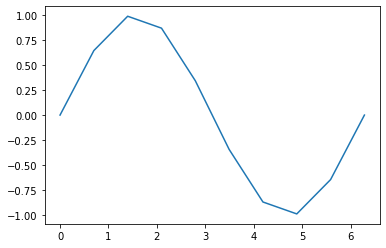
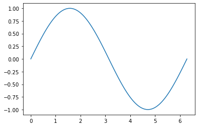

---
jupyter:
  jupytext:
    text_representation:
      extension: .md
      format_name: markdown
      format_version: '1.2'
      jupytext_version: 1.5.0
  kernelspec:
    display_name: Python 3
    language: python
    name: python3
---

<!-- #raw raw_mimetype="text/restructuredtext" -->
.. meta::
   :description: Topic: Math supplement, Difficulty: Easy, Category: Section
   :keywords: function, function composition, graphing, matplotlib
<!-- #endraw -->

# Functions


By now, you should be familiar with [Python functions](https://www.pythonlikeyoumeanit.com/Module2_EssentialsOfPython/Functions.html).
In this section, we will explore mathematical functions and how they relate to Python functions.
We will also discuss graphing of Python functions.

<!-- #region -->
## Review of Mathematical Functions

There are a number of ways to think about and define a function, but at its core, a function is a relationship between two sets of numbers.
A function maps every element in the first set of numbers, called the function's **domain**, to exactly one element in the second set, called the function's **codomain**.
Intuitively, we can think of the domain as the input to the function, the codomain as the output, and the function itself as the set of instructions (or operations) that tells us how to move a specific input to a specific output.


The notation of a function should be familiar.
We write $f(x)$ to state that our function is called $f$ and that it operates on the input $x$.
A function that adds five to the input, for example, would be written as $f(x) = x+5$.
Note that, very strictly speaking, in modern mathematics $f$ refers to the function, while $f(x)$ refers to the value of the function evaluated at the point $x$;
we will, however, abuse our notation and instead write $f(x)$ to mean both the function and the value of the function evaluated at $x$.
It is conventional to give a function a lower-case, one-letter name, such as $f(x)$, $g(x)$, or $\zeta(x)$, but some special functions, such as $\sin(x)$ and $\ln(x)$, have multi-character names.

We can, for example, define a function $f(x)$ that returns the cube of the input minus nine times the input as $f(x) = x^3 - 9x$.

In Python, functions are analogous to mathematical functions.
Much like a mathematical function, we can write Python functions that give instructions to map one set of numbers to another.
If we want to evaluate this mapping, we pass the function explicit and discrete arguments.
The Python function then performs some operations on the input and yields some value!

If we want to write the function $f(x)=x^3-9x$ in Python, we would simply write
<!-- #endregion -->

<!-- #region -->
```python
def f(x):
    """
    Parameters
    ----------
    x : Union[int, float]
        A number in the domain of our function,
        in this case, the set of real numbers
    
    Returns
    -------
    Union[int, float]
        A number in the codomain of our function,
        again the set of real numbers
    """
    return x ** 3 - 9 * x
```

To evaluate our function we pass in an element of the domain, which is, in this case, any int or float:

```
>>> f(5)
80
>>> f(3.)
0.0
```

<!-- #endregion -->

<div class="alert alert-info">

**Takeaway**:

Functions are powerful tools that map sets of numbers to each other.
The $f(x)$ notation allows us to define mathematical functions and the operations they perform.
Python functions give the instructions for how to map input to output, and we can use them to evaluate functions at discrete points.

</div>


<div class="alert alert-info">

**Reading Comprehension: Fun with Functions**

Using the $f(x)$ notation, write a function that doubles the input, then adds five to it.

</div>

## Function Composition


When the output of a function is used as the input of another function, we say that the two functions are composed.
Function composition allows us to chain together functions, which we can use to create complex mappings while maintaining modularity and readability.

Imagine that you are the owner of a pizza shop, and you want to write a mathematical formula for what you should charge customers. 
Specifically, you want to write a mathematical function that takes in the raw price of food and applies both sales tax and coupon discounts to it.
Call the raw price of the food in dollars $p$. 
The sales tax rate is $6.25\%$, so the price of the food after tax is applied is given by the function $t(p) = 1.0625 \cdot p$. 
Some customers also have a coupon that takes $\$5$ off of their meal, so their price should be $c(p) = p - 5$.
However, customers with a coupon still need to pay taxes on the entire meal! 
In order to calculate the appropriate price to charge customers, we can compose our two functions $t(p)$ and $c(p)$.

First, we want to calculate the price after tax. 
Then, we want to subtract five dollars from the pre-coupon price.
By chaining these functions together, we can determine the final cost of a pizza.
This way we can keep the functions as two separate, modular processes, while still using both to determine the final cost.
After all, not every customer will have a coupon so it is still useful to know how to compute the price only after tax.

Since we first want to compute the price after tax, then the price after applying coupons, we want to use the output of $t(p)$ as the input of $c(p)$.
We could write this as $c(t(p))$, but this can quickly turn into a mess of parentheses if we were to compose more functions.
In order to maintain readability, we instead write $c(t(p))$ as $(c \circ t)(p)$. 

More generally, we can write the composition of the functions $f(x)$ and $g(x)$ as $(f \circ g)(x)$, read as "$f$ of $g$ of $x$".
This states that we should take the output of $g(x)$ and use it as the input for $f(x)$.
This powerful notation allows us to compose as many functions as we'd like without overloading on parentheses! 
Consider the composition of five functions: $(f \circ g \circ h \circ i \circ j)(x)$ is much easier to read and interpret than $f(g(h(i(j(x)))))$!

When writing Python, function composition allows us to keep our code readable and modular.
Rather than writing one big function, we write several small functions, each of which completes one specific, self-contained task.
We can then compose these smaller functions to form the behavior of the full function! 

As an example, let's look at how we'd write our pizza shop functions in Python.

<!-- #region -->
```python
def t(p):
    """
    Parameters
    ----------
    p : Union[int, float]
        Price of pizza before tax
    
    Returns
    -------
    Union[int, float]
        Price of pizza after 6.25% tax applied
    
    """
    return 1.0625 * p


def c(p):
    """
    Parameters
    ----------
    p : Union[int, float]
        Price of pizza before coupon discount
    
    Returns
    -------
    Union[int, float]
        Price of pizza after $5 discount applied
    """
    return p - 5

>>> t(20)
21.25

>>> c(21.25)
16.25

>>> c(t(20))
16.25
```
<!-- #endregion -->

Writing code like this has many advantages. 
Imagine that the tax rate changed to $7\%$ and you needed to update the code.
Rather than searching through a longer function, you could simply update the `t(p)` function!
Code written like this is more readable, more modular, and much easier to debug than a version that doesn't use function composition.

<div class="alert alert-info">

**Takeaway**:

Function composition allows us to chain functions together.
This can simplify calculations and improve the quality of our code.
The notation $(f \circ g)(x)$ is used in lieu of $f(g(x))$ to create readable function compositions.

</div>

## Graphing Functions

In order to graph a mathematical function, the input of the function is graphed on the $x$-axis, and the output of the function is graphed on the $y$-axis. 
For example, below is the graph of the sine function $f(x) = \sin(x)$.

<!-- #raw -->
<div style="text-align: center">
<p>

</p>
</div>
<!-- #endraw -->

Often, when we graph a mathematical function by hand, we calculate just a few points, plot them, then fill in the rest with whatever looks right.
If we were to draw a sine wave by hand, for example, it would make sense to plot the peaks and valleys of the function as well as the zeros. 
Once that's done, it's easy to roughly fill in the curve by hand.
This method is easy, but imprecise.

It gets more accurate as we calculate more points, but it's not possible for us to calculate every single point!
In order to graph a function in Python, we'll take a similar approach by evaluating the function at a few sampled points, plotting those points, and connecting them.

To graph functions, we will use NumPy and Matplotlib. 
If you need a refresher for these libraries, please refer to the Python Like You Mean It sections on [the essentials of NumPy](https://www.pythonlikeyoumeanit.com/module_3.html) and [using Matplotlib](https://www.pythonlikeyoumeanit.com/Module5_OddsAndEnds/Matplotlib.html).

First, we will sample the domain of the function by picking points regularly spaced throughout the interval we wish to plot on.
We will then calculate the value of the function at each of those sampled points.
Finally, we will plot all of these points on the $x$-$y$ plane, using Matplotlib to connect them.

<!-- #region -->
```python
import matplotlib.pyplot as plt
import numpy as np

# We will take ten samples of the function.
samples = 10

# np.linspace samples the domain of the function, then we evaluate the function on those samples.
domain = np.linspace(0, 2 * np.pi, samples)
codomain = np.sin(domain)

# finally, we graph the function
fig, ax = plt.subplots()
ax.plot(domain, codomain)
```
<!-- #endregion -->

Running this code will give us the following graph.

<!-- #raw -->
<div style="text-align: center">
<p>

</p>
</div>
<!-- #endraw -->

As you can see, Matplotlib fills in the gaps between the points with straight lines.
With only $10$ samples though, our curve is quite rough.
For a smoother graph, we can increase the number of samples, thus making each of the connecting lines smaller and less sharply angled from one another.
Running the code with `samples = 100` gives us the following graph.

<!-- #raw -->
<div style="text-align: center">
<p>

</p>
</div>
<!-- #endraw -->

The graphed function appears to be smooth, but it's still just sampled points connected by straight lines.
If we were to zoom in enough, we would see the rough edges we saw when using $10$ samples.
However, by "densely" sampling the domain, we are able to give graphs the appearance of being continuous and smooth on the desired interval.


<div class="alert alert-info">

**Reading Comprehension: The Plot Thickens**

Use Python to graph the $f(x) = x^3 - 9x$.
Use $100$ samples, and graph it on the interval $[-5, 5]$.

</div>


## Functions with Multiple Inputs

Many functions have many inputs. 
We call these functions multivariable functions, because their output depends on multiple variables.
For a multivariable function with two inputs, we would write $f(x,y)$, where $x$ and $y$ are two distinct variables.
For instance, $f(x, y) = 2x-3y$ is a multivariable function, since the function uses two inputs to produce a single output.
Multivariable functions are not limited to only two variables though and can have any amount of inputs.

We can construct multivariable functions in Python as well.
We simply must take in additional arguments for each variable our function depends on.
We can write $f(x, y) = 2x -3y$ in Python as

<!-- #region -->
```python
def f(x, y):
    """
    Parameters
    ----------
    x : Union[int, float]
    y : Union[int, float]
    
    Returns
    -------
    Union[int, float]
    """
    return 2 * x - 3 * y
```

In order to evaluate our function, we must pass in a value for each argument;
passing in only one argument will throw an error:

```python
>>> f(5, 4.)
-2.0

>>> f(7)
TypeError: f() missing 1 required positional argument: 'y'
```

<!-- #endregion -->

As we continue our study of machine learning, we will frequently encounter complex, high-dimensional data and need to make liberal use of multivariable and composite functions.

## Links to Other Resources

- Python Like You Mean It: [Basics of Functions]((https://www.pythonlikeyoumeanit.com/Module2_EssentialsOfPython/Functions.html).)
- Python Like You Mean It: [The Essentials of NumPy](https://www.pythonlikeyoumeanit.com/module_3.html)
- Python Like You Mean It: [Matplotlib](https://www.pythonlikeyoumeanit.com/Module5_OddsAndEnds/Matplotlib.html)

## Reading Comprehension Exercise Solutions

**Fun with Functions: Solution**

\begin{equation}
f(x) = 2x - 5
\end{equation}

**The Plot Thickens: Solution**

```python
import matplotlib.pyplot as plt
import numpy as np


def f(x):
    """
    Parameters
    ----------
    x : Union[int, float]
        A value from the domain of f(x)
    
    Returns
    -------
    Union[int, float]
        A value in the codomain of f(x)
    """
    return x ** 3 - 9 * x


samples = 100

domain = np.linspace(-5, 5, samples)
codomain = f(domain)

fig, ax = plt.subplots()
ax.plot(domain, codomain)
```
