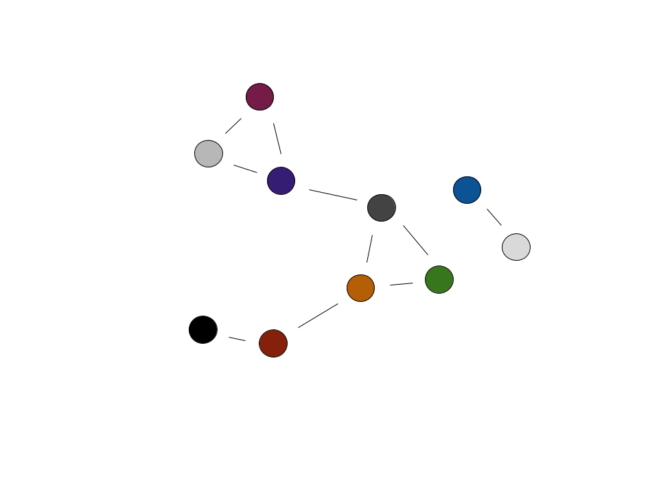
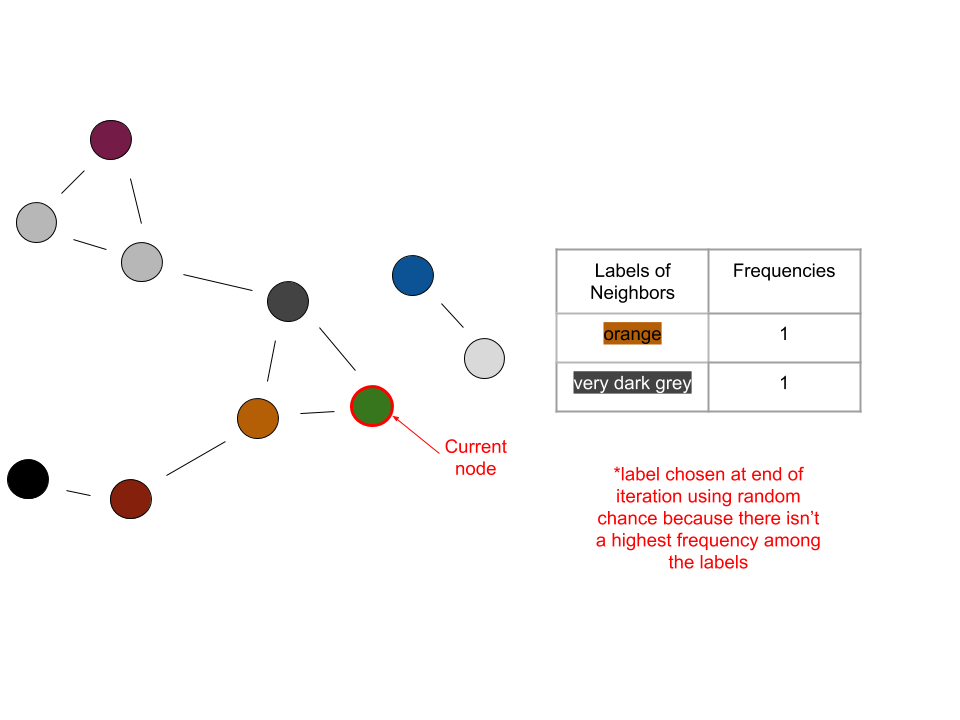
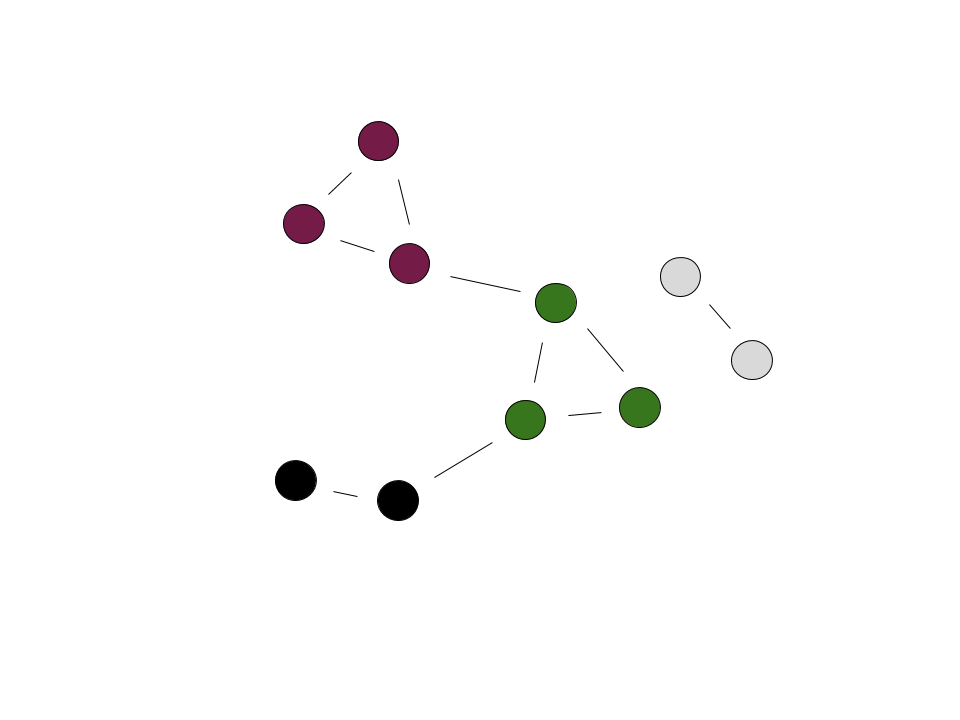

---
jupyter:
  jupytext:
    text_representation:
      extension: .md
      format_name: markdown
      format_version: '1.2'
      jupytext_version: 1.3.0
  kernelspec:
    display_name: Python [conda env:.conda-cogweb]
    language: python
    name: conda-env-.conda-cogweb-py
---

<!-- #raw raw_mimetype="text/restructuredtext" -->
.. meta::
   :description: Topic: Vision module, Difficulty: Easy, Category: Section
   :keywords: whispers algorithm, clustering images
<!-- #endraw -->

# Whispers Algorithm

In the second part of the capstone project, we want to be able to separate a group of pictures into groups of pictures of distinct individuals such that each individual in the database has a group of pictures.
Note that each picture should only contain one person.
For example, there would be two correct groups of a picture of two people who are both also in other pictures.
We don't want this to happen because an image can only be in one cluster.
We will be working with these pictures in the form of a 512-dimensional face descriptor vector which we will generate using `facenet_pytorch`'s trained resnet model.

Notice how this problem is different from the other part of the capstone:

- There are **no labels/truths** accompanying each piece of data
- We don't know the possible "classifications" which are in this case the people that can be present in the images

Because of these, it becomes apparent that training a neural network will not work.
We couldn't produce a loss function without knowing the *truths*, and that is necessary for the model to backpropagate and *learn*.

## Unsupervised Learning

This is where *unsupervised learning* comes in.
We will be revisiting this topic more formally in week three, but here is a general introduction.
This learning is unsupervised because the data does not come labeled - there is no point of reference to supervise by.
However, this method allows for *clustering* of data.
In this case, we will be grouping images using information from the cosine similarity between their descriptor vectors.

Note how much easier unsupervised training can be.
It is less expensive in terms of both time and money because a large amount of data doesn't need to be labeled.
In addition, large datasets for learning are not needed anymore.
It is important to really understand the structure of a problem and not develop an overkill solution.
If all we need is to separate a set of images into the different people contained in the images, we don't need to find or create and label a dataset.
We also don't need to worry about all the possible people the images could contain - or training a model.

## Breaking Down the Algorithm

Before we dive into the implementation of the algorithm, we have to understand a structure utilized in whispers: the **graph**.
The graph we are referring to isn't related to the coordinate plane, but rather one with *nodes* and *edges*.
Graphs are a large area of study, and we will only be touching on what is relevant for the whispers algorithm.
A graph can come in various forms, but the most common graphical representation uses circles to represent nodes and lines to represent edges.

<!-- #raw -->

<!-- #endraw -->

The nodes usually represent *things* and the edges the *relationship* between those things.
In our case, the node represents an image and the edge a similarity to another image.
Note how not all nodes have edges - think of this in our scenario as there being only one picture of a particular person in a set of images.

Now how do we represent a graph with *code*?
A common method is known as the **adjacency matrix**.
An adjacency matrix, $A$ is an $n$ by $n$ matrix, with $n$ being the number of nodes in the graph.
$A_{i, j}$ represents the relationship between nodes $i$ and $j$.
In our case, $A_{i, j}$ shows whether two nodes have an edge or not - $1$ could signify having an edge and $0$ not having one.

<!-- #raw -->

<!-- #endraw -->

The indices in the matrix are representing nodes.
Implementing a `node` class is recommended to keep things neat.
Referring to the `node.py` class that is prewritten can be helpful.
As a rule of thumb, we want the `node` object to include the following information:

- label (which cluster it is a part of)
- ID (a unique value in $[0,n-1]$, which can be the node's index in the adjacency matrix)
- neighbors (a list of the ID's of the node's neighbors)

The following steps outline the flow of the whispers algorithm:

1. Set up an adjacency matrix based on a cutoff
    * There is only an edge between two nodes, or images, if the two face descriptor vectors are "close enough" (note that when using cosine similarities, this translates to the *distance* between the vectors being **less** than the designated cutoff)
    * Initially each node has a unique label - the colors represent different labels

<!-- #raw -->

<!-- #endraw -->

2. Pick a random node
3. Count the frequency of the labels (each corresponding to a cluster) of its neighbors
4. The current node takes on the label of the most frequent label determined in the previous step
    * In the case of a tie, randomly choose a label from those that are tied    

5. Repeat this until the process converges (no change in number of labels) or a max number of iterations is reached

The previous four steps can be visualized as follows:

Iteration 1:
<!-- #raw -->

<!-- #endraw -->

Iteration 2:
<!-- #raw -->

<!-- #endraw -->

Iteration 3:
<!-- #raw -->

<!-- #endraw -->

In the last iteration shown, the current node would become orange because orange is the most frequent label among its neighbors.
When the number of labels converges, the end result could look like this:

<!-- #raw -->

<!-- #endraw -->

The final graph represents how the algorithm found three clusters of images, which corresponds to three different people. 

## Key Points

Some key ideas to keep in mind are:

- We want edges between nodes we are confident are related (images whose face descriptors are similar within a set cutoff, which can be guided by a little experimentation)
- We also want edges between nodes whose relationship is questionable - as we saw in the example graphs, some images had edges with others which were of a different person (we can accomplish this by having a looser cutoff)
- We don't want edges between all pairs of nodes
- We want to have a *max* set number of iterations to run because there is a possibility that convergence will never occur
- Because the first node and some labels are chosen randomly, there is a possibility of getting different results on different runs of the program on the same set of images
- Because of the variability caused by this randomness, the whispers algorithm isn't meant for really small sets of images - think about it like there is more scope for "correction" when there is an erroneous initial pairing of pictures in a large set
- An image can only be in one cluster at any given iteration
- For a better implementation of the whispers algorithm, use edge *weights* to aid choosing labels (refer to the next section)

## Whispers Algorithm With Weighted Edges

We know that the closer together descriptor vectors are, the more similar the corresponding images are.
However, in the implementation of the algorithm above, we are only using the vectors to determine whether nodes have edges or not.
When a node has a tie among the frequency of the labels in its neighbors, we are randomly choosing a label from among those tied.
However, what if we used the cosine similarity in determining which label to take on for each node?
This would result in a more accurate choice of label, and in less sporadic behavior in smaller sets of images.
A nuance in implementation would be to weight our edges using $1/x^2$, with $x$ being the cosine *distance* between the descriptor vectors.
For convenience, we will be using cosine distance, which is equivalent to $1 - \text{cosine similarity}$.
This scaling makes it easier to find images that are truly close and of the same person - try it both with and without the weighting and see if a difference is noticeable.
Now what does weighting an edge mean?
It means that instead of there being a binary distinction in terms of connection between nodes (connected or not), there will be a scale among those that are connected.
The ones that are closer in similarity will have a larger weight, which is determined using the $1/x^2$ from above.
Recall that cosine similarity returns a value from $0$ to $1$, with $0$ meaning two vectors are identical and $1$ meaning they are completely different (orthogonal).
Using the $1/x^2$ weighting results in a large weight for similar vectors.
Implementing this is quite similar to what we had previously.
Instead of simply putting a $1$ in the adjacency matrix to signify an edge, we will have $A_{i, j}$ contain $1/x^2$.

<!-- #raw -->

<!-- #endraw -->

Now determining which label to take on for each node can be broken down like this:

- have a weight sum corresponding to each label among the node's neighbors
- for each neighbor, the weight of the edge between it and the node will be added to the sum corresponding to the neighbor's label
- the node will take on the label with the highest corresponding weight sum

The process can be visualized as follows:

Iteration 1:
<!-- #raw -->

<!-- #endraw -->

Iteration 2:
<!-- #raw -->

<!-- #endraw -->

Iteration 3:
<!-- #raw -->

<!-- #endraw -->

Notice how the weighted edges reduced the need to randomly choose a label.
Using this method, choosing labels took place with an additional piece of information: a quantified similarity between a node and its neighboring nodes.

<!-- #raw -->

<!-- #endraw -->

The resulting graph from the running the weighted whispers algorithm is different from the one obtained using the normal algorithm!
Some of the clusters are composed of the same nodes, but have a different label.
This doesn't correlate to an actual difference in result - as long as the same images are grouped together, their corresponding label has no added significance.
Moreover, this subtlety goes to show the role randomness can play in the whispers algorithm.
However, a significant difference from before is the number of clusters: there are four instead of three.
The cluster distinguished by the black label was previously grouped with another cluster.
The implication could be that the normal whispers algorithm grouped two peoples' pictures together.
There are a few ways that chance could have played out that resulted in the merging of clusters.
It could be a good exercise to think through one or two.
Regardless, the increased robustness of the weighted whispers algorithm corresponds to leaving much fewer decisions to random chance.
Overall, this results in the weighted algorithm having a higher accuracy.

## Team Tasks

While everyone should understand the whispers algorithm, one to two people working on implementing it is likely enough.
Those who implement it could share their takeaways with the rest of the team.

## Taking it Further

These are ideas to take your project further if your team has the time:

- Display and label the results of the clustering (one possibility is in a grid view)
- When the program is run on a folder of images, have it automatically create folders of the different people/clusters with the corresponding images in them
