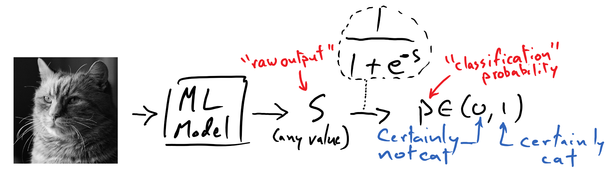

---
jupyter:
  jupytext:
    text_representation:
      extension: .md
      format_name: markdown
      format_version: '1.2'
      jupytext_version: 1.9.1
  kernelspec:
    display_name: Python [conda env:.conda-cogweb]
    language: python
    name: conda-env-.conda-cogweb-py
---

<!-- #raw raw_mimetype="text/restructuredtext" -->
.. meta::
   :description: Topic: machine learning, Category: Section
   :keywords: introduction, modeling, neural networks
<!-- #endraw -->

# The Problem of Modeling

Let's reflect on some typical problems that we might be interested in tackling via machine learning, and see how these can all be viewed through a unified framework.

<!-- #raw raw_mimetype="text/html" -->

<!-- #endraw -->

Displayed here are a diverse range of tasks that span an equally varied set of disciplines.

- Image classification (computer vision)
- Text comprehension (natural language processing / reasoning)
- Game strategization  (game artificial intelligence)
- Data extrapolation / phenomenological modeling (scientific computing)  

The common framework that undergirds each of these tasks is that a mathematical model will be used mediate the transformations of observations into the corresponding desired predictions or decisions.
Furthermore, from a machine learning perspective, we want to devise these models in such a way that they are capable of improving the quality of their predictions (or decisions) based on data that we provide them with; that is, we want them to able to learn.
It should be noted that a "mathematical model" need not merely be a single mathematical equation; it refers more broadly to a computer program that orchestrates a collection of mathematical equations and processes to transform the observed data.

Regardless of the fact that we hope to tackle these tasks using this common framework, the essential details of _how_ we solve these respective problems seems to be quite different from one another.
Traditionally, attempting to solve any of the above problems would require one to develop specialized knowledge in that subfield.

To develop a model that can classify pictures of cats versus dogs, for instance, would lead us down the path of learning about standard computer vision methods for measuring visual features – groups of edges, "blobs", and the like – within an image; we would then craft a model designed to extract and compose these features, and then give it the capacity to learn how these manifest differently among pictures of cats and dogs, respectively.
To provide some intuition about this, the image following depicts detected edges from a picture of a meerkat.

<!-- #raw raw_mimetype="text/html" -->

<!-- #endraw -->

Despite all of this hard work, we would have to start back at square one in our modeling process were we to later switch problem spaces to text comprehension (which is not to say that we wouldn't have gained valuable experience from our prior work, nor that there wouldn't be _some_ overlap in our approach to modeling). 

### The Role of Deep Learning

While this need for specialization can be expected to a degree, it represents a substantial barrier to entry for people entering into or switching between problem spaces.
This highlights a major challenge to the field of machine learning: can we identify generalizable methods for developing highly malleable models, which reduce the degree to which we have to invest in the manual modeling process, and instead empower the automated learning process to more profoundly "mold" the model?

The answer to this question appears to be "yes" – to a degree that we might have thought highly improbably back in, say, the year 2010.
Indeed, the recent surge in progress in the field of **deep learning**, which employs **neural networks** as the fundamental mathematical structure for the construction of the machine learning models, continues to unveil new ways in which we can design a model to act like a block of clay – one full of potential and capable of taking on any form – and to let the data-driven learning process act as the sculptor, in place of the human expert.

The success of deep learning, especially in the field of computer vision, is what enables us to tackle the rather audacious capstone project from the module: systematically sorting pictures based on the people in them.
By leveraging neural networks, we will be able to forgo lengthy lessons in classical computer vision-based signal processing techniques, which would be unwieldy for a module of such modest size.
Thus, we will proceed by first introducing ourselves to the process known as **supervised learning**, and then we proceed to learn about the fundamentals of modern neural networks.

## Representations of Data

Before we move on, it is useful to take a moment to clarify some important practical details that can be befuddling for newcomers to the field of machine learning.
While the exemplar machine learning tasks laid out above are easy enough to understand, it may be wholly unobvious to see *how* we can use math to process a picture or a sentence.
And for that matter, in what math class do we learn about mathematical functions that return "cat" or "dog" as their outputs?
I remember feeling uneasy about even asking these questions the first time that I had them, so this brief section is meant to allay such concerns and emphasize that our familiar toolkit of mathematics – linear algebra, calculus, signal processing, etc. – is still all that is in play here.
You were not sick during the class on "mathematics of cats and dogs". 

### Observed Data

Consider, for instance, the following $594 \times 580$ greyscale picture of a cat.

<!-- #raw raw_mimetype="text/html" -->

<!-- #endraw -->

This picture is stored on the computer as a rectangular array (with shape-$(594, 580)$) of numbers.
Each number tells the computer how bright it should make the corresponding pixel on the screen in order to render the image accurately;
the larger the number, the brighter the pixel.
In the case of a colored image, each pixel consists of three numbers instead of one, and they tell each pixel how much red, green, and blue color should be present in the pixel, respectively.

Thus we see that we might be more comfortable doing analysis on images than we might have thought.
When handed a png, we can easily [load that image as a NumPy array](https://www.pythonlikeyoumeanit.com/Module5_OddsAndEnds/Matplotlib.html#Displaying-Images) and proceed from there with our analysis.
While we might not yet know precisely what our mathematical approach will be to gleaning useful information from the image, we certainly are no longer in unfamiliar territory.

Working with text doesn't give us quite as clean of a story as does imagery — there is no text equivalent to a pixel.
Rather, a major challenge in the field of natural language processing is establishing a cogent numerical representation for text.
Ultimately, we will discuss this matter in some considerable depth in the course's language module.
But until then, rest assured that we will quickly find ourselves in familiar mathematical territory when working with text as well.

### Model Predictions

Finally, let's see how we might contrive our mathematical model to produce a number that could be interpretable as a "label" of the picture's contents. 

<!-- #raw raw_mimetype="text/html" -->

<!-- #endraw -->
